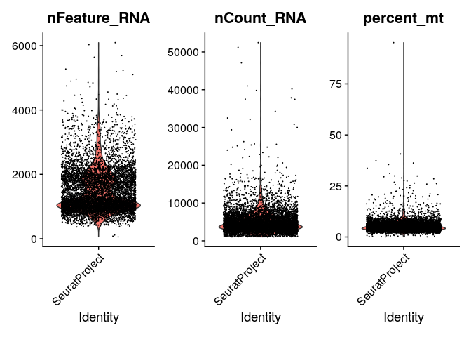
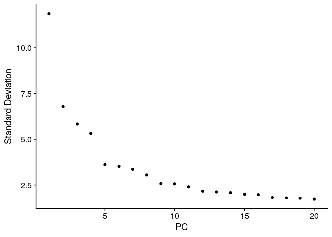
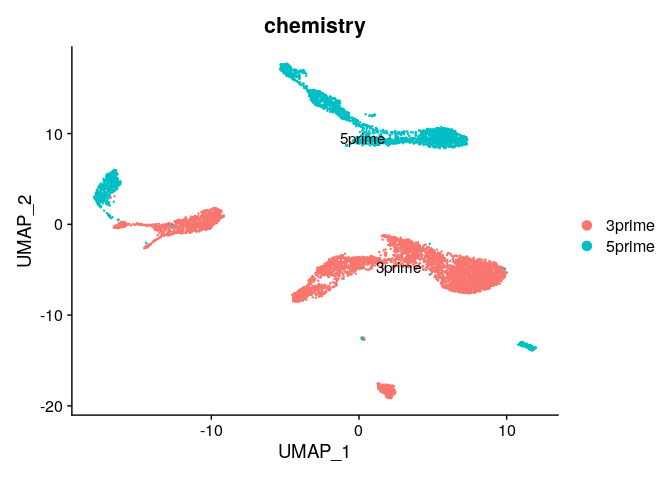
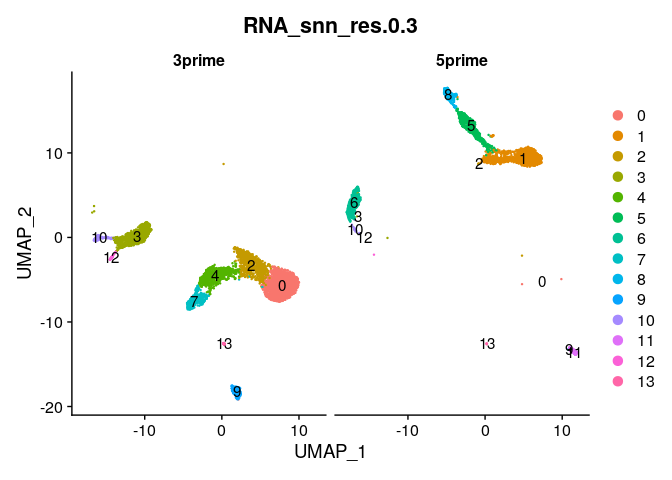
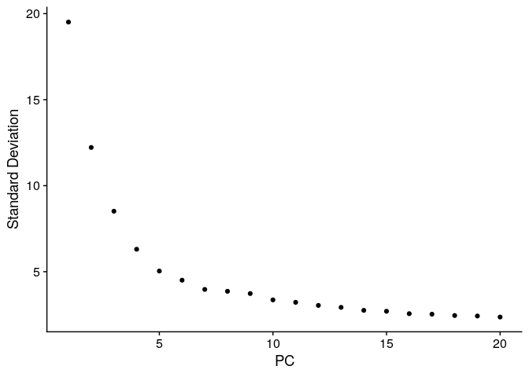
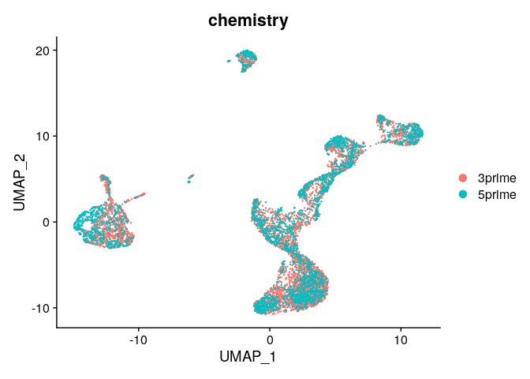
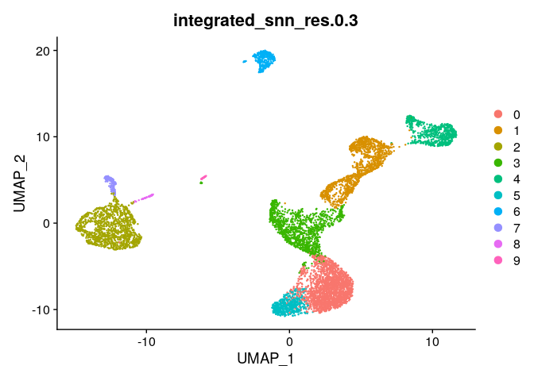

# Intro to data integration

A recurrent theme in -omics work is the notion of “batch effects”. This
term originates from the days of microarrays, when there would be slight
differences in annealing times and/or affinities between runs of
microarrays. “Batch effects” has now become a blanket colloquial term to
generally mean anything related to a technical artifact that arises
between samples or runs. The key is that it is not a true biological
signal, but instead something that should be “normalized away” to allow
real biological signals to shine.

Statistically, it is straightforward to control for a batch effect: if
you are using a linear model, for example, you could include the “batch”
as a covariate. The challenge really arises with high-dimensional
approaches such as principal component analysis or visualizing data in a
UMAP - often times, when batch effects are present, visualizations are
distorted or largely driven by these batch effects. There are
well-documented strategies for removing batch effect in microarrays or
bulk RNAseq data, which we will not discuss here.

For single-cell RNAseq analysis, we can use one simple approach called
“data integration” that is robustly implemented in Seurat. To
demonstrate this, we will use healthy donor PBMC that have been
generated with either 10X Genomics 3’ v2 chemistry or 5’ v1 chemistry.
The chemistry, in this case, is the batch effect we are trying to
remove.

# Prerequisites

We will need to download some dataset from the Cillo Laboratory
[tutorial\_datasets](https://github.com/CilloLaboratory/tutorial_datasets)
github page.

If you navigate to the link, click the code button on the top right, and
click “Download ZIP” it will download the whole repository including
directories containing the 10X scRNAseq datasets.

For this tutorial, we will be using the *PBMC\_integration\_datasets*
directory and enclosed files.

# Load packages

    library(Seurat)

    ## Attaching SeuratObject

    library(dplyr)

    ## 
    ## Attaching package: 'dplyr'

    ## The following objects are masked from 'package:stats':
    ## 
    ##     filter, lag

    ## The following objects are masked from 'package:base':
    ## 
    ##     intersect, setdiff, setequal, union

    library(patchwork)

    full_path <- "/home/rstudio/docker_rstudio/data/tutorial_datasets-main/PBMC_integration_datasets/"

    raw_files <- list.files(paste(full_path))

    # We don't want to read in the metadata as a 10X dataset
    # Let's remove it from the raw_files
    raw_files <- raw_files[!grepl("txt",raw_files)]
    raw_files

    ## [1] "HD_PBMC_1"        "HD_PBMC_1_5prime" "HD_PBMC_2"        "HD_PBMC_2_5prime"

    # Create list for Seurat object
    raw_list <- vector("list",length=length(raw_files))
    raw_list # empty list of length 4

    ## [[1]]
    ## NULL
    ## 
    ## [[2]]
    ## NULL
    ## 
    ## [[3]]
    ## NULL
    ## 
    ## [[4]]
    ## NULL

    # Loop to read filtered feature barcode matrices into R data into R
    for (i in 1:length(raw_list)) {
      
      raw_list[[i]] <- Read10X(paste(full_path,raw_files[i],sep=""))
      
    }

    # Name each item in the list by its title
    names(raw_list) <- raw_files
    names(raw_list)

    ## [1] "HD_PBMC_1"        "HD_PBMC_1_5prime" "HD_PBMC_2"        "HD_PBMC_2_5prime"

# Read in metadata and create Seurat objects

    # Read in the metadata
    metadata_file <- readr::read_tsv(paste(full_path,"pbmc_integration_metadata.txt",
                                           sep=""))

    ## Rows: 4 Columns: 3
    ## ── Column specification ────────────────────────────────────────────────────────
    ## Delimiter: "\t"
    ## chr (3): sample_id, sample_type, chemistry
    ## 
    ## ℹ Use `spec()` to retrieve the full column specification for this data.
    ## ℹ Specify the column types or set `show_col_types = FALSE` to quiet this message.

    # Make sure the order of names matches the raw data list 
    identical(metadata_file$sample_id,names(raw_list))

    ## [1] TRUE

    # Create an empty list of Seurat objects
    ser_list <- vector("list",length=length(raw_list))

    # Loop to Create individual Seurat objects and include metadata 
    for (i in 1:length(ser_list)) {
      
      # Create Seurat Object
      ser_list[[i]] <- CreateSeuratObject(raw_list[[i]])
      
      # Create metadata for each object
      meta_add <- data.frame(matrix(data=NA,
                                    nrow=ncol(ser_list[[i]]),
                                    ncol=ncol(metadata_file))
                             )
      colnames(meta_add) <- colnames(metadata_file)
      rownames(meta_add) <- colnames(ser_list[[i]])
      meta_add[,1] <- metadata_file[i,1] %>% pull()
      meta_add[,2] <- metadata_file[i,2] %>% pull()
      meta_add[,3] <- metadata_file[i,3] %>% pull()
      
      # Add Metadata
      ser_list[[i]] <- AddMetaData(ser_list[[i]],metadata=meta_add)

    }

    ## Warning: Feature names cannot have underscores ('_'), replacing with dashes
    ## ('-')

    ## Warning: Feature names cannot have underscores ('_'), replacing with dashes
    ## ('-')

    ## Warning: Feature names cannot have underscores ('_'), replacing with dashes
    ## ('-')

    ## Warning: Feature names cannot have underscores ('_'), replacing with dashes
    ## ('-')

    # Check out our list of Seurat objects
    ser_list

    ## [[1]]
    ## An object of class Seurat 
    ## 33694 features across 2445 samples within 1 assay 
    ## Active assay: RNA (33694 features, 0 variable features)
    ## 
    ## [[2]]
    ## An object of class Seurat 
    ## 33694 features across 1451 samples within 1 assay 
    ## Active assay: RNA (33694 features, 0 variable features)
    ## 
    ## [[3]]
    ## An object of class Seurat 
    ## 33694 features across 2436 samples within 1 assay 
    ## Active assay: RNA (33694 features, 0 variable features)
    ## 
    ## [[4]]
    ## An object of class Seurat 
    ## 33694 features across 1501 samples within 1 assay 
    ## Active assay: RNA (33694 features, 0 variable features)

# Merge list of Seurat objects into a single seurat object

    ser_merged <- merge(ser_list[[1]],ser_list[2:length(ser_list)])

    ## Warning in CheckDuplicateCellNames(object.list = objects): Some cell names are
    ## duplicated across objects provided. Renaming to enforce unique cell names.

    ser_merged@meta.data$sample_id %>%
      table()

    ## .
    ##        HD_PBMC_1 HD_PBMC_1_5prime        HD_PBMC_2 HD_PBMC_2_5prime 
    ##             2445             1451             2436             1501

    ser_merged@meta.data %>%
      select(sample_id,chemistry) %>%
      table()

    ##                   chemistry
    ## sample_id          3prime 5prime
    ##   HD_PBMC_1          2445      0
    ##   HD_PBMC_1_5prime      0   1451
    ##   HD_PBMC_2          2436      0
    ##   HD_PBMC_2_5prime      0   1501

# QC filtering

Now that we have out combined object, let’s perform some filtering
before we integrate.

    ser_merged[["percent_mt"]] <- PercentageFeatureSet(ser_merged, pattern = "^MT-")

    # Check out metadata now
    head(ser_merged@meta.data)

    ##                         orig.ident nCount_RNA nFeature_RNA sample_id
    ## AAACCTGCACAGACTT-1_1 SeuratProject       5192         1151 HD_PBMC_1
    ## AAACCTGCATCGGTTA-1_1 SeuratProject       2368          986 HD_PBMC_1
    ## AAACCTGTCAAGCCTA-1_1 SeuratProject       6676         1419 HD_PBMC_1
    ## AAACCTGTCTTAACCT-1_1 SeuratProject       2898         1050 HD_PBMC_1
    ## AAACGGGCAATAGCGG-1_1 SeuratProject       5450         1187 HD_PBMC_1
    ## AAACGGGGTAGCGATG-1_1 SeuratProject      11649         2338 HD_PBMC_1
    ##                      sample_type chemistry percent_mt
    ## AAACCTGCACAGACTT-1_1        PBMC    3prime   4.160247
    ## AAACCTGCATCGGTTA-1_1        PBMC    3prime   9.459459
    ## AAACCTGTCAAGCCTA-1_1        PBMC    3prime   4.988017
    ## AAACCTGTCTTAACCT-1_1        PBMC    3prime   5.279503
    ## AAACGGGCAATAGCGG-1_1        PBMC    3prime   4.623853
    ## AAACGGGGTAGCGATG-1_1        PBMC    3prime   3.802902

    # We can also plot values from metadata
    VlnPlot(ser_merged, features = c("nFeature_RNA", "nCount_RNA", "percent_mt"), ncol = 3)

    # Filtering is often dataset specific
    # Here, we want more than 200 and less than 3000 features
    # Plus % mito < 20%
    ser_merged <- subset(ser_merged, subset = nFeature_RNA > 200 & nFeature_RNA < 3000 & percent_mt < 20)

    # Check out the cells left 
    ser_merged@meta.data %>%
      select(sample_id,chemistry) %>%
      table()

    ##                   chemistry
    ## sample_id          3prime 5prime
    ##   HD_PBMC_1          2436      0
    ##   HD_PBMC_1_5prime      0   1284
    ##   HD_PBMC_2          2428      0
    ##   HD_PBMC_2_5prime      0   1380

# Standard workflow

We will run the standard workflow first to demonstrate the chemistry
specific batch effects.

    # Store the filtered and un-manipulated dataset
    ser_merged_save <- ser_merged

    ser_merged <- ser_merged %>% 
        NormalizeData(.) %>%
        FindVariableFeatures(.) %>%
        ScaleData(.) %>%
        RunPCA(.) 

    ## Centering and scaling data matrix

    ## PC_ 1 
    ## Positive:  IL32, CD3E, RPS18, RPS12, RPL30, EEF1A1, LTB, LDHB, RPS21, TRBC2 
    ##     IFITM1, TRAC, IL7R, CD7, RPLP0, RPS8, RPL37, TRBC1, TCF7, NOSIP 
    ##     LINC00861, CD69, CCR7, GZMM, LEF1, CAMK4, MAL, CD247, FLT3LG, FCMR 
    ## Negative:  FCN1, CST3, LYZ, S100A9, S100A8, VCAN, MNDA, FGL2, CTSS, LST1 
    ##     SERPINA1, CYBB, CD14, CSTA, MS4A6A, MPEG1, SAT1, CLEC7A, TYMP, TYROBP 
    ##     SPI1, S100A12, FTL, PSAP, FOS, CSF3R, NCF2, TMEM176B, GRN, NEAT1 
    ## PC_ 2 
    ## Positive:  RPS17, LTB, RPS18, RPLP1, RPS8, RPS12, CCR7, EEF1A1, LDHB, TPT1 
    ##     MAL, CD79A, LEF1, RPL30, RPLP0, RPL37, TRABD2A, TCF7, MS4A1, TRAC 
    ##     NOSIP, LINC00926, FHIT, MYC, HLA-DRA, BANK1, BIRC3, SELL, AIF1, NCF1 
    ## Negative:  CST7, NKG7, PRF1, GZMA, GNLY, KLRD1, GZMB, CTSW, FGFBP2, CCL5 
    ##     HOPX, SPON2, GZMH, ADGRG1, HLA-B, FCGR3A, KLRF1, CCL4, S1PR5, IL2RB 
    ##     HLA-C, MATK, CD247, CD99, PFN1, CLIC3, HLA-A, ITGB2, PRSS23, IFITM2 
    ## PC_ 3 
    ## Positive:  TMSB4X, S100A6, TRAC, RPS17, CXCL8, IL1B, S100A4, TNFAIP3, S100A9, NEAT1 
    ##     S100A12, S100A8, IL32, NAMPT, NFKBIA, CSTA, NFKBIZ, ANXA1, CH17-373J23.1, CCL3 
    ##     AIF1, LDHB, FOS, CD3E, IER3, LYZ, VCAN, NOSIP, SRGN, CTD-3252C9.4 
    ## Negative:  MS4A1, CD79A, BANK1, FAM129C, LINC00926, CD19, CD79B, TCL1A, FCRLA, HLA-DQA1 
    ##     FCER2, VPREB3, IGHM, HLA-DOB, BLNK, BLK, CD22, RALGPS2, IGHD, FCRL1 
    ##     IGKC, RP11-693J15.5, CD74, SPIB, HLA-DQA2, POU2AF1, PAX5, TSPAN13, HLA-DPA1, HVCN1 
    ## PC_ 4 
    ## Positive:  MT-ATP8, MTRNR2L12, MT-ND4L, AC090498.1, EEF1G, COL6A3, GABARAP, NME2, GIMAP7, PTPRCAP 
    ##     IL7R, MT-ATP6, ATP6V0C, RPS21, MT-ND6, GIMAP4, LIME1, RP11-290D2.6, TPT1, CD3E 
    ##     DGKA, HIST1H4C, LEF1, RPL37, CTB-133G6.1, CCR7, INPP4B, AC006129.2, RPL30, MT-ND5 
    ## Negative:  RPS17, TMSB4X, NFKBIA, CYBA, GNLY, NKG7, GZMB, KLRF1, TRDC, IL1B 
    ##     CCL4, FGFBP2, HOPX, SPON2, CXCL8, C1orf56, ID2, KLRD1, NR4A2, GZMA 
    ##     CCL3, DUSP1, CLIC3, CCL5, FCGR3A, FCER1G, CST7, TYROBP, GZMH, KLRB1 
    ## PC_ 5 
    ## Positive:  CXCL8, IL1B, CH17-373J23.1, RP11-1143G9.4, RP11-160E2.6, S100A12, CCL3, FOSB, IER3, MT-ATP6 
    ##     MCL1, LINC00936, MT-CO2, NAMPT, LUCAT1, CTB-61M7.2, PTPRCAP, KLF6, CTDSPL, TMEM107 
    ##     PTGS2, NFKBIA, KLF10, S100A8, CCL3L3, VCAN, ANKRD28, TRIB1, TNFAIP3, ZFP36L1 
    ## Negative:  LILRA4, CDKN1C, PLD4, CSF1R, SERPINF1, CKB, IL3RA, LILRB4, HES4, LILRB2 
    ##     LILRB1, PPP1R14B, CD68, TBC1D8, GAS6, LRRC26, PTCRA, CLEC4C, TCF7L2, SMPD3 
    ##     MS4A4A, HMOX1, FCGR3A, RHOC, LINC00996, SCT, LRRC25, CDH23, SIGLEC10, TPM2

    ElbowPlot(ser_merged)

    ser_merged <- ser_merged %>%
        RunUMAP(.,dims=1:10) %>%
        FindNeighbors(.,dims=1:10) %>%
        FindClusters(.,res=c(0.3,0.5,0.7))

    ## Warning: The default method for RunUMAP has changed from calling Python UMAP via reticulate to the R-native UWOT using the cosine metric
    ## To use Python UMAP via reticulate, set umap.method to 'umap-learn' and metric to 'correlation'
    ## This message will be shown once per session

    ## 21:14:16 UMAP embedding parameters a = 0.9922 b = 1.112

    ## 21:14:16 Read 7528 rows and found 10 numeric columns

    ## 21:14:16 Using Annoy for neighbor search, n_neighbors = 30

    ## 21:14:16 Building Annoy index with metric = cosine, n_trees = 50

    ## 0%   10   20   30   40   50   60   70   80   90   100%

    ## [----|----|----|----|----|----|----|----|----|----|

    ## **************************************************|
    ## 21:14:16 Writing NN index file to temp file /tmp/Rtmp1pnHMW/file1b6541c7897
    ## 21:14:16 Searching Annoy index using 1 thread, search_k = 3000
    ## 21:14:18 Annoy recall = 100%
    ## 21:14:18 Commencing smooth kNN distance calibration using 1 thread with target n_neighbors = 30
    ## 21:14:18 Initializing from normalized Laplacian + noise (using irlba)
    ## 21:14:18 Commencing optimization for 500 epochs, with 311174 positive edges
    ## 21:14:23 Optimization finished
    ## Computing nearest neighbor graph
    ## Computing SNN

    ## Modularity Optimizer version 1.3.0 by Ludo Waltman and Nees Jan van Eck
    ## 
    ## Number of nodes: 7528
    ## Number of edges: 263376
    ## 
    ## Running Louvain algorithm...
    ## Maximum modularity in 10 random starts: 0.9513
    ## Number of communities: 14
    ## Elapsed time: 0 seconds
    ## Modularity Optimizer version 1.3.0 by Ludo Waltman and Nees Jan van Eck
    ## 
    ## Number of nodes: 7528
    ## Number of edges: 263376
    ## 
    ## Running Louvain algorithm...
    ## Maximum modularity in 10 random starts: 0.9319
    ## Number of communities: 15
    ## Elapsed time: 0 seconds
    ## Modularity Optimizer version 1.3.0 by Ludo Waltman and Nees Jan van Eck
    ## 
    ## Number of nodes: 7528
    ## Number of edges: 263376
    ## 
    ## Running Louvain algorithm...
    ## Maximum modularity in 10 random starts: 0.9125
    ## Number of communities: 15
    ## Elapsed time: 0 seconds

    Idents(ser_merged) <- "RNA_snn_res.0.3"

    DimPlot(ser_merged,group.by="chemistry",label=T)

    DimPlot(ser_merged,group.by="RNA_snn_res.0.3",split.by="chemistry",label=T)

    # Check out chemistry-specific clusters
    ser_merged@meta.data %>%
      select(RNA_snn_res.0.3,chemistry) %>%
      table()

    ##                chemistry
    ## RNA_snn_res.0.3 3prime 5prime
    ##              0    1748      2
    ##              1       0   1216
    ##              2     818      6
    ##              3     767      3
    ##              4     700      0
    ##              5       0    564
    ##              6       0    458
    ##              7     398      0
    ##              8       0    254
    ##              9     212      4
    ##              10    127     20
    ##              11      0    130
    ##              12     61      2
    ##              13     33      5

# Batch effects

Clearly, there are strong batch effects associated with the chemistry
used to generated the data. Let’s look at how we can correct these batch
effects by integrating the datasets.

We will use the SCTransform and rpca approaches described by the Satija
Lab in Seurat. More info on integration approaches is available
[here](https://satijalab.org/seurat/articles/integration_rpca#modifying-the-strength-of-integration-1).

    ser_merged_split <- SplitObject(ser_merged, split.by = "chemistry")

    # lapply applies the FUN (function) to each member of the list and returns a list
    ser_merged_split <- lapply(X = ser_merged_split, FUN = SCTransform, method = "glmGamPoi")

    ## Calculating cell attributes from input UMI matrix: log_umi

    ## Variance stabilizing transformation of count matrix of size 15205 by 4864

    ## Model formula is y ~ log_umi

    ## Get Negative Binomial regression parameters per gene

    ## Using 2000 genes, 4864 cells

    ##   |                                                                              |                                                                      |   0%  |                                                                              |==================                                                    |  25%  |                                                                              |===================================                                   |  50%  |                                                                              |====================================================                  |  75%  |                                                                              |======================================================================| 100%

    ## Found 102 outliers - those will be ignored in fitting/regularization step

    ## Second step: Get residuals using fitted parameters for 15205 genes

    ##   |                                                                              |                                                                      |   0%  |                                                                              |==                                                                    |   3%  |                                                                              |=====                                                                 |   6%  |                                                                              |=======                                                               |  10%  |                                                                              |=========                                                             |  13%  |                                                                              |===========                                                           |  16%  |                                                                              |==============                                                        |  19%  |                                                                              |================                                                      |  23%  |                                                                              |==================                                                    |  26%  |                                                                              |====================                                                  |  29%  |                                                                              |=======================                                               |  32%  |                                                                              |=========================                                             |  35%  |                                                                              |===========================                                           |  39%  |                                                                              |=============================                                         |  42%  |                                                                              |================================                                      |  45%  |                                                                              |==================================                                    |  48%  |                                                                              |====================================                                  |  52%  |                                                                              |======================================                                |  55%  |                                                                              |=========================================                             |  58%  |                                                                              |===========================================                           |  61%  |                                                                              |=============================================                         |  65%  |                                                                              |===============================================                       |  68%  |                                                                              |==================================================                    |  71%  |                                                                              |====================================================                  |  74%  |                                                                              |======================================================                |  77%  |                                                                              |========================================================              |  81%  |                                                                              |===========================================================           |  84%  |                                                                              |=============================================================         |  87%  |                                                                              |===============================================================       |  90%  |                                                                              |=================================================================     |  94%  |                                                                              |====================================================================  |  97%  |                                                                              |======================================================================| 100%

    ## Computing corrected count matrix for 15205 genes

    ##   |                                                                              |                                                                      |   0%  |                                                                              |==                                                                    |   3%  |                                                                              |=====                                                                 |   6%  |                                                                              |=======                                                               |  10%  |                                                                              |=========                                                             |  13%  |                                                                              |===========                                                           |  16%  |                                                                              |==============                                                        |  19%  |                                                                              |================                                                      |  23%  |                                                                              |==================                                                    |  26%  |                                                                              |====================                                                  |  29%  |                                                                              |=======================                                               |  32%  |                                                                              |=========================                                             |  35%  |                                                                              |===========================                                           |  39%  |                                                                              |=============================                                         |  42%  |                                                                              |================================                                      |  45%  |                                                                              |==================================                                    |  48%  |                                                                              |====================================                                  |  52%  |                                                                              |======================================                                |  55%  |                                                                              |=========================================                             |  58%  |                                                                              |===========================================                           |  61%  |                                                                              |=============================================                         |  65%  |                                                                              |===============================================                       |  68%  |                                                                              |==================================================                    |  71%  |                                                                              |====================================================                  |  74%  |                                                                              |======================================================                |  77%  |                                                                              |========================================================              |  81%  |                                                                              |===========================================================           |  84%  |                                                                              |=============================================================         |  87%  |                                                                              |===============================================================       |  90%  |                                                                              |=================================================================     |  94%  |                                                                              |====================================================================  |  97%  |                                                                              |======================================================================| 100%

    ## Calculating gene attributes

    ## Wall clock passed: Time difference of 20.18736 secs

    ## Determine variable features

    ## Place corrected count matrix in counts slot

    ## Centering data matrix

    ## Set default assay to SCT

    ## Calculating cell attributes from input UMI matrix: log_umi

    ## Variance stabilizing transformation of count matrix of size 14953 by 2664

    ## Model formula is y ~ log_umi

    ## Get Negative Binomial regression parameters per gene

    ## Using 2000 genes, 2664 cells

    ##   |                                                                              |                                                                      |   0%  |                                                                              |==================                                                    |  25%  |                                                                              |===================================                                   |  50%  |                                                                              |====================================================                  |  75%  |                                                                              |======================================================================| 100%

    ## Found 131 outliers - those will be ignored in fitting/regularization step

    ## Second step: Get residuals using fitted parameters for 14953 genes

    ##   |                                                                              |                                                                      |   0%  |                                                                              |==                                                                    |   3%  |                                                                              |=====                                                                 |   7%  |                                                                              |=======                                                               |  10%  |                                                                              |=========                                                             |  13%  |                                                                              |============                                                          |  17%  |                                                                              |==============                                                        |  20%  |                                                                              |================                                                      |  23%  |                                                                              |===================                                                   |  27%  |                                                                              |=====================                                                 |  30%  |                                                                              |=======================                                               |  33%  |                                                                              |==========================                                            |  37%  |                                                                              |============================                                          |  40%  |                                                                              |==============================                                        |  43%  |                                                                              |=================================                                     |  47%  |                                                                              |===================================                                   |  50%  |                                                                              |=====================================                                 |  53%  |                                                                              |========================================                              |  57%  |                                                                              |==========================================                            |  60%  |                                                                              |============================================                          |  63%  |                                                                              |===============================================                       |  67%  |                                                                              |=================================================                     |  70%  |                                                                              |===================================================                   |  73%  |                                                                              |======================================================                |  77%  |                                                                              |========================================================              |  80%  |                                                                              |==========================================================            |  83%  |                                                                              |=============================================================         |  87%  |                                                                              |===============================================================       |  90%  |                                                                              |=================================================================     |  93%  |                                                                              |====================================================================  |  97%  |                                                                              |======================================================================| 100%

    ## Computing corrected count matrix for 14953 genes

    ##   |                                                                              |                                                                      |   0%  |                                                                              |==                                                                    |   3%  |                                                                              |=====                                                                 |   7%  |                                                                              |=======                                                               |  10%  |                                                                              |=========                                                             |  13%  |                                                                              |============                                                          |  17%  |                                                                              |==============                                                        |  20%  |                                                                              |================                                                      |  23%  |                                                                              |===================                                                   |  27%  |                                                                              |=====================                                                 |  30%  |                                                                              |=======================                                               |  33%  |                                                                              |==========================                                            |  37%  |                                                                              |============================                                          |  40%  |                                                                              |==============================                                        |  43%  |                                                                              |=================================                                     |  47%  |                                                                              |===================================                                   |  50%  |                                                                              |=====================================                                 |  53%  |                                                                              |========================================                              |  57%  |                                                                              |==========================================                            |  60%  |                                                                              |============================================                          |  63%  |                                                                              |===============================================                       |  67%  |                                                                              |=================================================                     |  70%  |                                                                              |===================================================                   |  73%  |                                                                              |======================================================                |  77%  |                                                                              |========================================================              |  80%  |                                                                              |==========================================================            |  83%  |                                                                              |=============================================================         |  87%  |                                                                              |===============================================================       |  90%  |                                                                              |=================================================================     |  93%  |                                                                              |====================================================================  |  97%  |                                                                              |======================================================================| 100%

    ## Calculating gene attributes

    ## Wall clock passed: Time difference of 12.0156 secs

    ## Determine variable features

    ## Place corrected count matrix in counts slot

    ## Centering data matrix

    ## Set default assay to SCT

    # Identify the conserved features for integration 
    features <- SelectIntegrationFeatures(object.list = ser_merged_split, 
                                          nfeatures = 2000
                                          )

    # Prepare for integration 
    ser_merged_split <- PrepSCTIntegration(object.list = ser_merged_split, anchor.features = features)
    ser_merged_split <- lapply(X = ser_merged_split, FUN = RunPCA, features = features)

    ## PC_ 1 
    ## Positive:  RPS27, RPS29, RPL3, CCL5, NKG7, RPS6, RPS3, RPL31, RPS18, LTB 
    ##     GNLY, RPS12, IL32, RPL13, RPL13A, RPS4X, RPS25, RPS15A, RPLP2, RPL30 
    ##     RPS14, RPL10, KLRB1, EEF1A1, TRAC, TRBC1, TRBC2, RPL32, RPL21, CD3D 
    ## Negative:  LYZ, S100A9, S100A8, FTL, CST3, FOS, TYROBP, NEAT1, CTSS, FTH1 
    ##     S100A12, IL1B, SAT1, HLA-DRA, LST1, CXCL8, FCN1, LGALS1, VCAN, RP11-1143G9.4 
    ##     DUSP1, S100A6, CSTA, NFKBIA, FCER1G, AIF1, CH17-373J23.1, GPX1, S100A4, NAMPT 
    ## PC_ 2 
    ## Positive:  LTB, RPL34, RPS27, RPL32, RPL13, RPS6, RPL21, RPS18, RPS12, EEF1A1 
    ##     RPS3A, RPS8, RPS29, RPL13A, RPLP2, HLA-DRA, RPS25, RPS14, RPL30, RPLP1 
    ##     RPS15A, RPS4X, RPL31, LDHB, RPL10, CD79A, CCR7, RPL3, CD74, RPS19 
    ## Negative:  NKG7, GNLY, CCL5, GZMB, FGFBP2, GZMA, CST7, PRF1, KLRB1, GZMH 
    ##     CTSW, TRDC, KLRD1, B2M, SPON2, HOPX, KLRF1, FCGR3A, CMC1, PFN1 
    ##     CCL4, CLIC3, HLA-B, S100A4, IFITM2, MATK, MYO1F, KLRC1, TRGC1, ACTB 
    ## PC_ 3 
    ## Positive:  S100A8, S100A9, S100A12, CXCL8, VCAN, FOS, LYZ, RP11-1143G9.4, IL1B, CH17-373J23.1 
    ##     RP11-160E2.6, DUSP6, LINC00936, NEAT1, NFKBIA, NAMPT, CCL3, MCL1, KLF6, TNFAIP3 
    ##     CD14, RPL34, SOD2, MNDA, IL7R, TRAC, IL32, NFKBIZ, CYP1B1, S100A6 
    ## Negative:  CD74, HLA-DRA, HLA-DPB1, HLA-DPA1, HLA-DRB1, HLA-DQB1, HLA-DQA1, IGKC, CD79A, HLA-DRB5 
    ##     MS4A1, CD79B, IGHM, HLA-DMA, IGHD, TCL1A, CST3, JCHAIN, LINC00926, BANK1 
    ##     IGLC2, HLA-DMB, HLA-DQA2, IRF8, PLD4, SPIB, VPREB3, CD22, HERPUD1, IGLC3 
    ## PC_ 4 
    ## Positive:  S100A8, S100A9, CD79A, IGKC, S100A12, FOS, CXCL8, VCAN, CD74, LYZ 
    ##     RP11-1143G9.4, MS4A1, IGHM, HLA-DRA, IGHD, TCL1A, LINC00926, IGLC2, BANK1, IL1B 
    ##     CH17-373J23.1, JCHAIN, RP11-160E2.6, KLF6, VPREB3, CD79B, CCL5, HLA-DQB1, NKG7, GNLY 
    ## Negative:  AIF1, LST1, FCGR3A, IFITM3, CST3, FCER1G, COTL1, MS4A7, FTH1, CFD 
    ##     CDKN1C, SAT1, LINC01272, FTL, IFI30, SERPINA1, TYROBP, CD68, CKB, RHOC 
    ##     S100A11, HES4, CSF1R, LILRB2, TCF7L2, SPI1, PSAP, LRRC25, S100A4, PILRA 
    ## PC_ 5 
    ## Positive:  GZMB, ITM2C, SERPINF1, PLD4, PPP1R14B, LILRA4, IRF7, JCHAIN, LRRC26, IRF8 
    ##     TPM2, CLIC3, TCF4, PTCRA, DERL3, CCDC50, GAS6, CLEC4C, ALOX5AP, SMPD3 
    ##     IL3RA, C12orf75, CST3, PTPRS, APP, UGCG, MZB1, PTGDS, NPC2, LILRB4 
    ## Negative:  CD79A, MS4A1, CD79B, CCL5, IGHD, IGHM, LINC00926, BANK1, IGLC2, DUSP1 
    ##     CD52, VPREB3, GZMK, CD22, CXCR4, HLA-DRA, FCER2, JUN, IGLC3, JUNB 
    ##     TNFRSF13C, FTL, SAT1, FCRLA, P2RX5, FCRL1, NEAT1, MT-CO1, HLA-DPA1, DUSP2

    ## PC_ 1 
    ## Positive:  NKG7, RPS27, CCL5, IL32, GNLY, IL7R, IFITM1, RPS12, LTB, RPS29 
    ##     CD3E, CST7, RPS3, RPS15A, RPL10, EEF1A1, RPL3, RPL30, GZMA, RPS18 
    ##     B2M, RPL13, PRF1, CTSW, RPS3A, LDHB, RPS25, KLRB1, RPS6, RPL32 
    ## Negative:  LYZ, S100A8, S100A9, FCN1, CST3, VCAN, FOS, CTSS, TYROBP, FTL 
    ##     SAT1, PSAP, DUSP1, MNDA, NEAT1, HLA-DRA, CD74, S100A6, CD14, S100A12 
    ##     AIF1, LST1, HLA-DRB1, SERPINA1, FGL2, FTH1, CYBB, CSF3R, TYMP, MS4A6A 
    ## PC_ 2 
    ## Positive:  NKG7, GNLY, CCL5, CST7, GZMB, PRF1, GZMA, FGFBP2, KLRD1, GZMH 
    ##     FCGR3A, CTSW, CCL4, SPON2, KLRF1, HOPX, TYROBP, ADGRG1, KLRB1, CLIC3 
    ##     CX3CR1, TRDC, SRGN, IL2RB, B2M, IFITM2, FCER1G, S1PR5, SH2D1B, CD247 
    ## Negative:  LTB, RPS12, RPL32, RPS8, RPL13, LDHB, CCR7, IL7R, RPLP1, EEF1A1 
    ##     RPL34, RPL30, TCF7, LEF1, RPS18, RPS3A, RPS27, MAL, RPS6, CD79A 
    ##     RPL10, RPS25, NOSIP, RPS15A, RPS29, MS4A1, HLA-DQA1, RPS14, HLA-DRA, SELL 
    ## PC_ 3 
    ## Positive:  IL7R, LDHB, S100A8, IL32, S100A9, FOS, VCAN, CD3E, S100A6, LYZ 
    ##     S100A12, TCF7, S100A4, FCN1, LEF1, NOSIP, VIM, GIMAP7, CD8B, CD3D 
    ##     MAL, RP11-291B21.2, MNDA, NEAT1, CSF3R, S100A11, DUSP1, CAMK4, RPS12, CD14 
    ## Negative:  CD74, HLA-DRA, HLA-DQA1, HLA-DRB5, HLA-DRB1, HLA-DPA1, CD79A, HLA-DPB1, MS4A1, CD79B 
    ##     BANK1, HLA-DQB1, FAM129C, LINC00926, RALGPS2, TCL1A, FCER2, CD19, HLA-DQA2, CD37 
    ##     HLA-DOB, IGHM, FCRLA, HVCN1, VPREB3, CD22, BLK, MEF2C, IGKC, HLA-DMA 
    ## PC_ 4 
    ## Positive:  CCL5, GZMK, TRDV2, TRGV9, DUSP2, IL32, NKG7, KLRG1, LYAR, AC092580.4 
    ##     IL7R, GZMH, S100A4, CD8A, LAG3, CD52, AHNAK, CXCR4, ZNF683, CD3G 
    ##     CD3D, SYNE2, ZFP36L2, MT-CYB, ANXA1, PTMS, CD74, CD3E, MT-CO1, KLF6 
    ## Negative:  FCER1G, FCGR3A, TYROBP, KLRF1, SPON2, SH2D1B, CLIC3, GZMB, CD7, IGFBP7 
    ##     IFITM3, AKR1C3, CHST2, IFITM2, IL2RB, FGFBP2, CCR7, TXK, PLAC8, CD247 
    ##     PRF1, TTC38, NCR1, CD38, IFITM1, CX3CR1, LEF1, LGALS9C, ADGRG1, LINC00299 
    ## PC_ 5 
    ## Positive:  MT-CO1, MALAT1, MT-CO2, MT-ND3, FOS, MT-ND4, CSF3R, MT-CO3, MT-ND1, VCAN 
    ##     MT-ND2, NEAT1, RGS2, DUSP1, MT-ATP6, JUN, MT-CYB, RP6-159A1.4, NCF1, MT-ATP8 
    ##     S100A8, PADI4, SLC11A1, MXD1, CYP1B1, USP15, EGR1, SLC2A3, RP11-160E2.6, NAIP 
    ## Negative:  HLA-DRB1, S100A4, FTH1, HLA-DPA1, HLA-DRB5, S100A11, COTL1, IL32, LGALS1, LST1 
    ##     NPC2, AIF1, HLA-DPB1, CFD, LGALS3, IFITM3, CD74, S100A10, CD68, SERPINA1 
    ##     SH3BGRL3, FCER1G, CST3, GSTP1, TMEM176B, HLA-DRA, LINC01272, CSF1R, S100A6, PILRA

    # Find anchors and integrate
    anchors_to_use <- FindIntegrationAnchors(object.list = ser_merged_split,
                                             normalization.method = "SCT",
                                             anchor.features = features,
                                             dims = 1:30, 
                                             reduction = "rpca",
                                             k.anchor = 20)

    ## Computing within dataset neighborhoods

    ## Finding all pairwise anchors

    ## Projecting new data onto SVD
    ## Projecting new data onto SVD

    ## Finding neighborhoods

    ## Finding anchors

    ##  Found 17241 anchors

    ser_integrated <- IntegrateData(anchorset = anchors_to_use, 
                                    normalization.method = "SCT", 
                                    dims = 1:30)

    ## Merging dataset 2 into 1

    ## Extracting anchors for merged samples

    ## Finding integration vectors

    ## Finding integration vector weights

    ## Integrating data

# Run PCA, UMAP and clustering on integrated data

    ser_integrated <- RunPCA(ser_integrated,verbose = FALSE)

    ElbowPlot(ser_integrated)

    ser_integrated <- RunUMAP(ser_integrated, reduction = "pca", dims = 1:10) %>%
      FindNeighbors(.,dims=1:10) %>%
      FindClusters(.,res=c(0.3,0.5,0.7))

    ## 21:15:31 UMAP embedding parameters a = 0.9922 b = 1.112

    ## 21:15:31 Read 7528 rows and found 10 numeric columns

    ## 21:15:31 Using Annoy for neighbor search, n_neighbors = 30

    ## 21:15:31 Building Annoy index with metric = cosine, n_trees = 50

    ## 0%   10   20   30   40   50   60   70   80   90   100%

    ## [----|----|----|----|----|----|----|----|----|----|

    ## **************************************************|
    ## 21:15:32 Writing NN index file to temp file /tmp/Rtmp1pnHMW/file1b655befdec
    ## 21:15:32 Searching Annoy index using 1 thread, search_k = 3000
    ## 21:15:34 Annoy recall = 100%
    ## 21:15:34 Commencing smooth kNN distance calibration using 1 thread with target n_neighbors = 30
    ## 21:15:35 Initializing from normalized Laplacian + noise (using irlba)
    ## 21:15:35 Commencing optimization for 500 epochs, with 307598 positive edges
    ## 21:15:40 Optimization finished
    ## Computing nearest neighbor graph
    ## Computing SNN

    ## Modularity Optimizer version 1.3.0 by Ludo Waltman and Nees Jan van Eck
    ## 
    ## Number of nodes: 7528
    ## Number of edges: 251352
    ## 
    ## Running Louvain algorithm...
    ## Maximum modularity in 10 random starts: 0.9331
    ## Number of communities: 10
    ## Elapsed time: 0 seconds
    ## Modularity Optimizer version 1.3.0 by Ludo Waltman and Nees Jan van Eck
    ## 
    ## Number of nodes: 7528
    ## Number of edges: 251352
    ## 
    ## Running Louvain algorithm...
    ## Maximum modularity in 10 random starts: 0.9068
    ## Number of communities: 13
    ## Elapsed time: 0 seconds
    ## Modularity Optimizer version 1.3.0 by Ludo Waltman and Nees Jan van Eck
    ## 
    ## Number of nodes: 7528
    ## Number of edges: 251352
    ## 
    ## Running Louvain algorithm...
    ## Maximum modularity in 10 random starts: 0.8842
    ## Number of communities: 15
    ## Elapsed time: 0 seconds

# Visualize integrated data

    colnames(ser_integrated@meta.data)

    ##  [1] "orig.ident"             "nCount_RNA"             "nFeature_RNA"          
    ##  [4] "sample_id"              "sample_type"            "chemistry"             
    ##  [7] "percent_mt"             "RNA_snn_res.0.3"        "RNA_snn_res.0.5"       
    ## [10] "RNA_snn_res.0.7"        "seurat_clusters"        "nCount_SCT"            
    ## [13] "nFeature_SCT"           "integrated_snn_res.0.3" "integrated_snn_res.0.5"
    ## [16] "integrated_snn_res.0.7"

    # Notice the clustering results now have the preface "integrated"
    # Instead of RNA 

    # A new assay is present called "integrated"
    ser_integrated

    ## An object of class Seurat 
    ## 52029 features across 7528 samples within 3 assays 
    ## Active assay: integrated (2000 features, 2000 variable features)
    ##  2 other assays present: RNA, SCT
    ##  2 dimensional reductions calculated: pca, umap

    ser_integrated@assays

    ## $RNA
    ## Assay data with 33694 features for 7528 cells
    ## First 10 features:
    ##  RP11-34P13.3, FAM138A, OR4F5, RP11-34P13.7, RP11-34P13.8,
    ## RP11-34P13.14, RP11-34P13.9, FO538757.3, FO538757.2, AP006222.2 
    ## 
    ## $SCT
    ## SCTAssay data with 16335 features for 7528 cells, and 2 SCTModel(s) 
    ## First 10 features:
    ##  RP11-34P13.7, FO538757.2, AP006222.2, RP4-669L17.10, RP11-206L10.9,
    ## LINC00115, FAM41C, RP11-54O7.1, SAMD11, NOC2L 
    ## 
    ## $integrated
    ## SCTAssay data with 2000 features for 7528 cells, and 1 SCTModel(s) 
    ## Top 10 variable features:
    ##  S100A8, S100A9, LYZ, GNLY, NKG7, CD74, HLA-DRA, CST3, FOS, CCL5

    # View by chemistry and clusters
    DimPlot(ser_integrated,group.by="chemistry")

    DimPlot(ser_integrated,group.by="integrated_snn_res.0.3")

    # View chemistry across clusters - much better 
    ser_integrated@meta.data %>%
      select(integrated_snn_res.0.3,chemistry) %>%
      table()

    ##                       chemistry
    ## integrated_snn_res.0.3 3prime 5prime
    ##                      0   1487    574
    ##                      1    696    535
    ##                      2    771    452
    ##                      3    764    456
    ##                      4    381    255
    ##                      5    335    223
    ##                      6    213    134
    ##                      7    124     26
    ##                      8     60      4
    ##                      9     33      5

# Identifying DEGs

Now that we have integrated the datasets, we can look for differentially
expressed genes across the clusters.

It’s important to now switch back to the RNA assay. We do not want to
use only the 2000 highly variable genes contained in the integrated
assay to find differentially expressed genes.

    DefaultAssay(ser_integrated) <- "RNA"
    Idents(ser_integrated) <- "integrated_snn_res.0.3"

    # Using logfc.thresold at 0.5 to speed this up 
    all_degs <- FindAllMarkers(ser_integrated,logfc.threshold = 0.5)

    ## Calculating cluster 0

    ## Calculating cluster 1

    ## Calculating cluster 2

    ## Calculating cluster 3

    ## Calculating cluster 4

    ## Calculating cluster 5

    ## Calculating cluster 6

    ## Calculating cluster 7

    ## Calculating cluster 8

    ## Calculating cluster 9

    all_degs %>%
      group_by(cluster) %>%
      top_n(5,avg_log2FC) %>%
      arrange(desc(avg_log2FC))

    ## # A tibble: 50 × 7
    ## # Groups:   cluster [10]
    ##        p_val avg_log2FC pct.1 pct.2 p_val_adj cluster gene    
    ##        <dbl>      <dbl> <dbl> <dbl>     <dbl> <fct>   <chr>   
    ##  1 0               2.12 0.995 0.18  0         2       S100A8  
    ##  2 0               2.04 0.993 0.265 0         2       S100A9  
    ##  3 0               2.00 0.998 0.271 0         2       LYZ     
    ##  4 3.27e-130       1.95 1     0.064 1.10e-125 9       JCHAIN  
    ##  5 0               1.81 0.968 0.038 0         6       CD79A   
    ##  6 0               1.78 0.93  0.036 0         2       VCAN    
    ##  7 0               1.75 0.986 0.259 0         4       GNLY    
    ##  8 1.67e-114       1.74 1     0.127 5.63e-110 8       HLA-DQA1
    ##  9 9.49e-182       1.73 0.947 0.038 3.20e-177 9       PLD4    
    ## 10 0               1.73 0.953 0.078 0         2       FCN1    
    ## # ℹ 40 more rows

# Conclusions

We have now walked through a method to integrate two datasets that have
a known batch effect like chemistry. In practice, a batch effect can be
anything from a patient specific sample to differences in how data was
generated or differences in sequencing depth between samples.

# Saving data

    # saveRDS(ser_integrated,file=paste(full_path,"PBMC_integration_final_output_231024.rds",sep=""))
